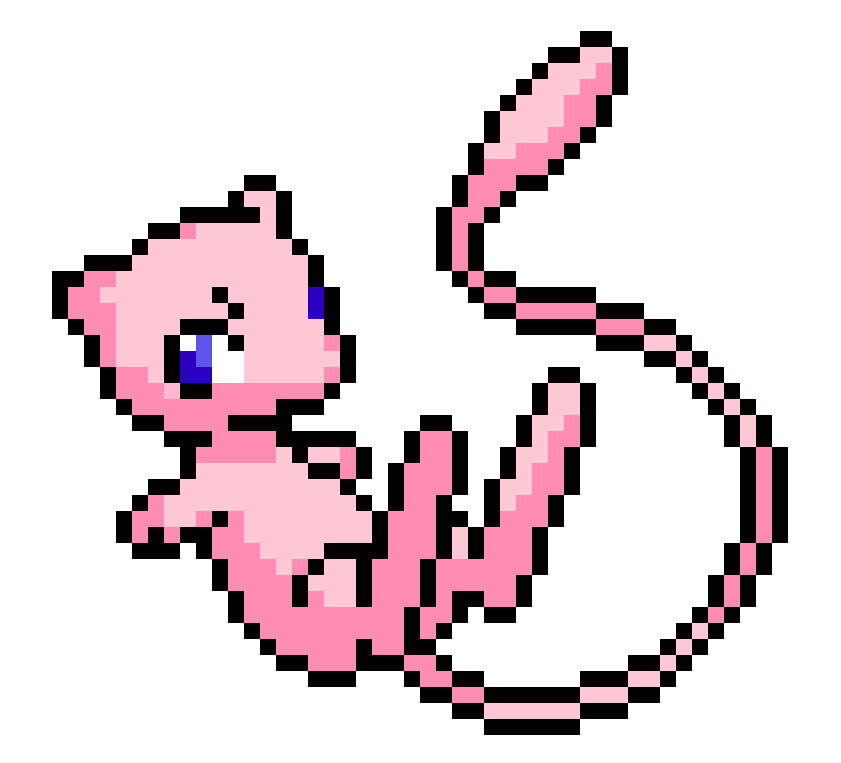

# Hello world!

Lorem ipsum dolor sit amet, consectetur adipiscing elit. Donec tincidunt dignissim varius. Aliquam volutpat nibh ut sapien interdum, a suscipit urna accumsan. Sed commodo a quam eu dapibus. Proin interdum laoreet arcu sit amet faucibus. Maecenas non ligula purus. Aenean pretium leo nec ligula congue consequat. Nunc et sapien vel est hendrerit luctus faucibus eu erat. Fusce ultricies eu ipsum at vestibulum. Nunc quis efficitur nunc, eu accumsan massa. Nam sit amet purus in augue lacinia maximus ac sed nunc. Suspendisse potenti. Etiam orci diam, porttitor et sem vitae, cursus ultrices quam. Etiam iaculis porta libero, lacinia mollis enim ornare aliquet. Sed viverra velit et nibh convallis tempus.

# Stats

 

  <a href="https://github.com/Pedroxhrq">
  
  

 

 
    

